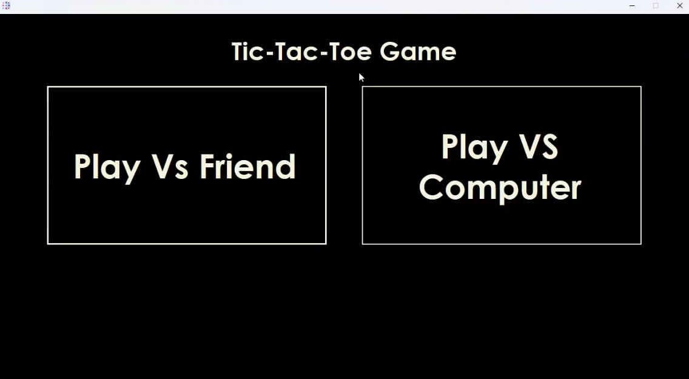
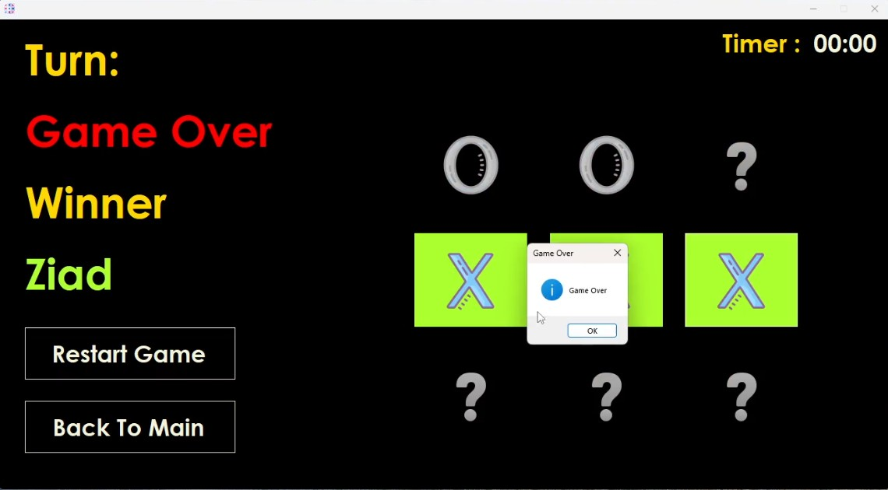
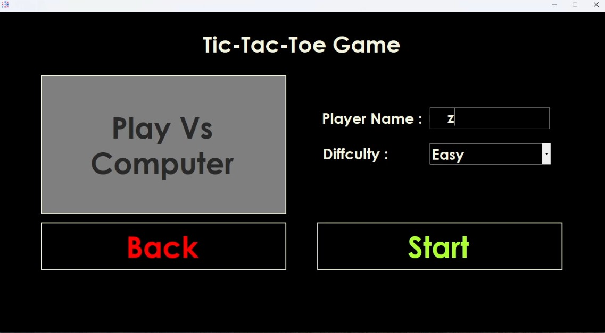

# 🎮 Tic-Tac-Toe (C# WinForms)

A simple yet feature-rich **Tic-Tac-Toe** game built using **C# Windows Forms**.  
You can play either:
- **Player vs Friend (2 Players)**  
- **Player vs Computer** with difficulty levels: Easy, Medium, Hard  

The game also features a timer, restart functionality, and a clean UI.

---

## ✨ Features
- ✅ Play **1v1 (local multiplayer)**  
- ✅ Play against the **Computer (AI)**  
- ✅ Difficulty Levels: **Easy, Medium, Hard**  
- ✅ Countdown Timer per turn (20s default)  
- ✅ Game Over detection (Win/Draw)  
- ✅ Restart or return to main menu anytime  
- ✅ Polished UI with hover/click effects  

---

## 🖥️ Screenshots
## 🖼️ Screenshots

Here’s an example of the Main screen:

Here’s an example of the Play Vs Friend screen:

Here’s an example of the Play Vs Computer screen:

---

##📝 License
This project is provided for educational purposes only.
